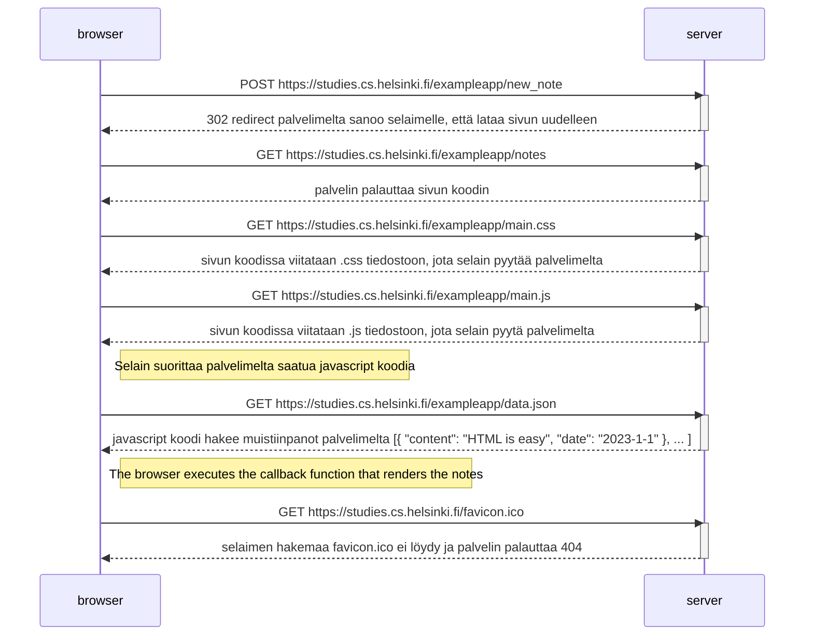

```mermaid
sequenceDiagram
    participant browser
    participant server
    
    browser->>server: POST https://studies.cs.helsinki.fi/exampleapp/new_note
    activate server
    server-->>browser: 302 redirect palvelimelta sanoo selaimelle, että lataa sivun uudelleen
    deactivate server

    browser->>server: GET https://studies.cs.helsinki.fi/exampleapp/notes
    activate server
    server-->>browser: palvelin palauttaa sivun koodin
    deactivate server
    
    browser->>server: GET https://studies.cs.helsinki.fi/exampleapp/main.css
    activate server
    server-->>browser: sivun koodissa viitataan .css tiedostoon, jota selain pyytää palvelimelta
    deactivate server
    
    browser->>server: GET https://studies.cs.helsinki.fi/exampleapp/main.js
    activate server
    server-->>browser: sivun koodissa viitataan .js tiedostoon, jota selain pyytä palvelimelta
    deactivate server
    
    Note right of browser: Selain suorittaa palvelimelta saatua javascript koodia
    
    browser->>server: GET https://studies.cs.helsinki.fi/exampleapp/data.json
    activate server
    server-->>browser:javascript koodi hakee muistiinpanot palvelimelta [{ "content": "HTML is easy", "date": "2023-1-1" }, ... ]
    deactivate server    

    Note right of browser: The browser executes the callback function that renders the notes

    browser->>server: GET https://studies.cs.helsinki.fi/favicon.ico
    activate server
    server-->>browser: selaimen hakemaa favicon.ico ei löydy ja palvelin palauttaa 404 
    deactivate server
```
