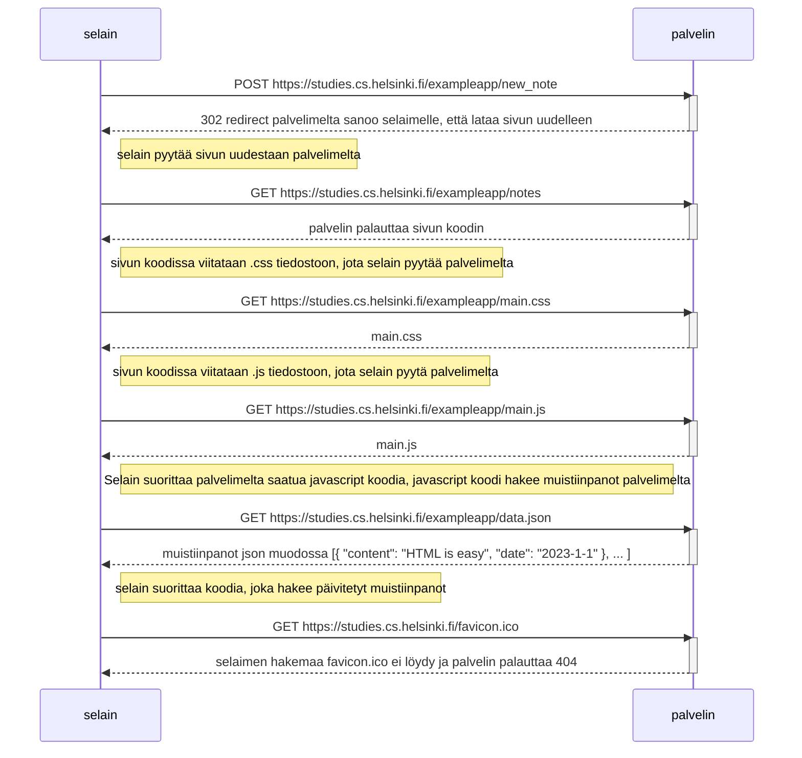

```mermaid
sequenceDiagram
    participant selain
    participant palvelin
    
    selain->>palvelin: POST https://studies.cs.helsinki.fi/exampleapp/new_note
    activate palvelin
    palvelin-->>selain: 302 redirect palvelimelta sanoo selaimelle, että lataa sivun uudelleen
    deactivate palvelin

    Note right of selain: selain pyytää sivun uudestaan palvelimelta

    selain->>palvelin: GET https://studies.cs.helsinki.fi/exampleapp/notes
    activate palvelin
    palvelin-->>selain: palvelin palauttaa sivun koodin
    deactivate palvelin

     Note right of selain: sivun koodissa viitataan .css tiedostoon, jota selain pyytää palvelimelta
    selain->>palvelin: GET https://studies.cs.helsinki.fi/exampleapp/main.css
    activate palvelin
    palvelin-->>selain: main.css
    deactivate palvelin

     Note right of selain: sivun koodissa viitataan .js tiedostoon, jota selain pyytä palvelimelta
    selain->>palvelin: GET https://studies.cs.helsinki.fi/exampleapp/main.js
    activate palvelin
    palvelin-->>selain: main.js
    deactivate palvelin
    
    Note right of selain: Selain suorittaa palvelimelta saatua javascript koodia, javascript koodi hakee muistiinpanot palvelimelta
    
    selain->>palvelin: GET https://studies.cs.helsinki.fi/exampleapp/data.json
    activate palvelin
    palvelin-->>selain:muistiinpanot json muodossa [{ "content": "HTML is easy", "date": "2023-1-1" }, ... ]
    deactivate palvelin    

    Note right of selain: selain suorittaa koodia, joka hakee päivitetyt muistiinpanot

    selain->>palvelin: GET https://studies.cs.helsinki.fi/favicon.ico
    activate palvelin
    palvelin-->>selain: selaimen hakemaa favicon.ico ei löydy ja palvelin palauttaa 404 
    deactivate palvelin
```
